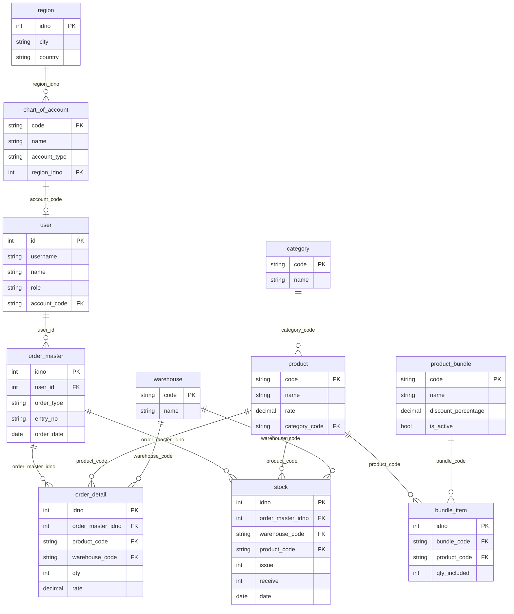

<div align="center">

# 🛒 OrderHub

**A full-stack e-commerce platform built with Django & Raw PostgreSQL**

[](https://python.org)
[](https://djangoproject.com)
[](https://postgresql.org)
[](LICENSE)

*A DBMS course project demonstrating raw SQL operations, transaction management, and relational database design within a modern web application.*

---

[Features](#-features) · [Database Schema](#-database-schema) · [Getting Started](#-getting-started) · [Project Structure](#-project-structure) · [SQL Techniques](#-key-sql-techniques)

</div>

---

## ✨ Features

### 🛍️ Customer Storefront
- **Product Browsing** — Search by name, filter by category, and sort by price (low/high)
- **Smart Cart** — Per-user cart stored in `localStorage` with quantity selectors (−/+), remove buttons, and real-time totals
- **Bundle Carousel** — Interactive bundle cards showing discount percentages, original vs. discounted pricing, and item contents via modals
- **Checkout with Region Tracking** — City and country captured at checkout; regions are auto-created or matched case-insensitively
- **Order History** — Full order history dashboard with drill-down to line-item details and grand totals

### 🔧 Admin Panel
- **Product Management** — Add/edit/delete products (`PRD-001`…) and categories (`CAT-001`…) with cascading safety checks (stock records, bundle membership)
- **Bundle Management** — Full CRUD for product bundles with dynamic item rows, activate/deactivate toggle, and "nuke-and-pave" editing via atomic transactions
- **Order Tracking** — View all purchase and restock orders with user info, line-item detail, and warehouse assignments
- **Chart of Accounts** — Lazily-created customer accounts (`CUST-1001`…), editable account names, and supplier onboarding (`SUPP-1001`…) with linked dummy user accounts and regional data
- **Stock & Restocking** — Real-time stock summary grouped by product and warehouse, color-coded quantity indicators (OK / Low / Out), warehouse-locked restocking to prevent product splits
- **Reports Dashboard** — 10 unified reports across three categories:
  - **Sales** — Detail, Summary, Customer-Wise, Product-Wise
  - **Purchase** — Detail, Summary, Supplier-Wise, Product-Wise
  - **Stock** — Current Balance, Item Ledger with date filtering

### 🔐 Authentication & Security
- **Role-Based Access** — `customer` and `admin` roles with strict decorator-based isolation
- **Lazy Account Initialization** — Ledger accounts created only when a customer places their first order
- **Parameterized Queries** — All SQL uses `%s` placeholders to prevent SQL injection
- **CSRF Protection** — Django's built-in CSRF middleware on all POST forms
- **Premium Login & Register** — Glassmorphism UI with animated gradient backgrounds, floating orbs, and frosted-glass cards

### 🗄️ Database Design
- **100% Raw SQL** — No Django ORM for data operations; all queries use `with connection.cursor() as cursor:`
- **PostgreSQL Backend** — Full Postgres-native syntax (`ILIKE`, `RETURNING`, `CAST(SUBSTRING(...) AS INTEGER)`, etc.)
- **Atomic Transactions** — Checkout, restock, and bundle editing wrapped in `transaction.atomic()` for all-or-nothing safety
- **Double-Entry Stock Ledger** — Stock tracked via `issue`/`receive` pattern: `available = SUM(receive) - SUM(issue)`
- **Historical Rate Snapshots** — Order detail stores the price at time of purchase, preserving pricing history

---

## 📊 Database Schema

The application uses **11 tables** with strict `snake_case` naming:



### Auto-Generated Code Sequences

| Entity | Pattern | Example |
|---|---|---|
| Product | `PRD-XXX` | PRD-001, PRD-002, PRD-003… |
| Category | `CAT-XXX` | CAT-001, CAT-002, CAT-003… |
| Bundle | `BDL-XXX` | BDL-001, BDL-002, BDL-003… |
| Customer Account | `CUST-XXXX` | CUST-1001, CUST-1002… |
| Supplier Account | `SUPP-XXXX` | SUPP-1001, SUPP-1002… |
| Purchase Order | `ORD-XXXXX` | ORD-00001, ORD-00002… |
| Restock Order | `RST-XXXXX` | RST-00001, RST-00002… |

---

## 🚀 Getting Started

### Prerequisites

- Python 3.12+
- PostgreSQL 14+
- pip

### Installation

```bash
# Clone the repository
git clone https://github.com/Maaz-A-Khan/Ecommerce-App.git
cd Ecommerce-App

# Create and activate virtual environment
python -m venv venv
venv\Scripts\activate        # Windows
# source venv/bin/activate   # macOS/Linux

# Install dependencies
pip install -r requirements.txt
```

### Database Setup

```bash
# Create a PostgreSQL database
psql -U postgres
CREATE DATABASE orderhub;
\q
```

Update `orderhub/orderhub/settings.py` with your PostgreSQL credentials:

```python
DATABASES = {
    'default': {
        'ENGINE': 'django.db.backends.postgresql',
        'NAME': 'orderhub',
        'USER': 'postgres',
        'PASSWORD': 'your_password',
        'HOST': 'localhost',
        'PORT': '5432',
    }
}
```

### Run Migrations & Start

```bash
cd orderhub
python manage.py makemigrations
python manage.py migrate

# Create an admin user
python manage.py createsuperuser
# Then go to Django admin (/admin/) and set the user's role to 'admin'

# Start the development server
python manage.py runserver
```

### Initial Setup

After starting the server, configure via Django's built-in admin at `http://127.0.0.1:8000/admin/`:

1. **Set admin role** — Edit your superuser and set `role = admin`
2. **Create a warehouse** — Add at least one warehouse (e.g., code: `WH-01`, name: `Main Warehouse`)
3. **Add categories** — Use the custom admin panel at `/admin-panel/products/`
4. **Add products** — Same page, select a category and enter name + rate
5. **Add a supplier** — Go to `/admin-panel/accounts/` and add a supplier
6. **Restock products** — Go to `/admin-panel/stock/` and place restock orders

Now register a customer account at `/register/` and start shopping!

---

## 📁 Project Structure

```
Ecommerce-App/
├── orderhub/                           # Django project root
│   ├── manage.py
│   ├── orderhub/                       # Project settings
│   │   ├── settings.py                 # PostgreSQL config, installed apps
│   │   ├── urls.py                     # Root URL conf
│   │   └── wsgi.py
│   └── core/                           # Main application
│       ├── models.py                   # 11 models (schema-only, no ORM queries)
│       ├── views.py                    # 20+ views (all raw SQL)
│       ├── urls.py                     # 26 URL patterns
│       ├── admin.py                    # Django admin registrations
│       ├── static/
│       │   ├── style.css               # Complete design system (~1400 lines)
│       │   └── main.js                 # Cart logic, filters & UI rendering
│       └── templates/
│           ├── base.html               # Customer layout (sidebar + topbar)
│           ├── base_auth.html          # Auth layout (register)
│           ├── admin_base.html         # Admin layout (sidebar + topbar)
│           ├── login.html              # Glassmorphism login page
│           ├── register.html           # Glassmorphism registration page
│           ├── dashboard.html          # Customer quick-access dashboard
│           ├── products.html           # Products with search/sort/filter + bundle carousel
│           ├── checkout.html           # Cart + city/country + place order
│           ├── customer_dashboard.html # Order history list
│           ├── customer_order_detail.html  # Order drill-down
│           ├── admin_products.html     # Products & categories CRUD + edit modal
│           ├── admin_bundles.html      # Bundle list + create form + toggle/delete
│           ├── edit_bundle.html        # Bundle edit page (dynamic item rows)
│           ├── admin_orders.html       # All orders list
│           ├── admin_order_detail.html # Admin order drill-down
│           ├── admin_accounts.html     # Customers + suppliers + edit modal
│           ├── admin_stock.html        # Stock summary + restock form
│           └── admin_reports.html      # 10-report dashboard with date filtering
├── requirements.txt
└── README.md
```

---

## 🖼️ Screenshots

> Screenshots can be added here after running the application.

| Page | Description |
|---|---|
| Login | Animated gradient with glassmorphism card and floating orbs |
| Register | Matching frosted-glass card with premium input styling |
| Products | Data table with search, category filter, sort, and bundle carousel |
| Checkout | Cart summary table + region fields + place order |
| Customer Orders | Order history with drill-down to line-item details |
| Admin Products | Add/edit/delete products & categories with modal editing |
| Admin Bundles | Create/edit/toggle/delete bundles with dynamic item rows |
| Admin Stock | Color-coded stock levels per warehouse + restock form |
| Admin Accounts | Customer & supplier accounts with inline name editing |
| Admin Reports | 10 reports across sales, purchase, and stock categories |

---

## 🔑 Key SQL Techniques

| Technique | Usage |
|---|---|
| `COALESCE(SUM(...), 0)` | Null-safe stock aggregation |
| `CAST(SUBSTRING(code FROM N) AS INTEGER)` | Sequential code generation (PostgreSQL syntax) |
| `ILIKE %s` | Case-insensitive search filtering |
| `LOWER(col) = LOWER(%s)` | Case-insensitive region matching |
| `INSERT INTO ... RETURNING idno` | Fetching auto-increment PKs in PostgreSQL |
| `CURRENT_DATE` | PostgreSQL date functions |
| `NOT is_active` / `IS TRUE` | Boolean toggling and filtering |
| Multi-table `JOIN` | Order details with product, warehouse, user, and account info |
| `transaction.atomic()` | All-or-nothing checkout, restock, and bundle edit operations |
| `DELETE` + `INSERT` (nuke-and-pave) | Transactional bundle item replacement |
| `SUM() ... GROUP BY` | Aggregated reports (customer-wise, product-wise, supplier-wise) |
| `BETWEEN %s AND %s` | Date-range filtering on reports |

---

## 🛡️ Deletion Safeguards

The application enforces referential integrity at the application layer before any `DELETE`:

| Entity | Check Before Delete |
|---|---|
| Product | ① Has stock records? ② Is part of any bundle? |
| Category | Has products assigned? |
| Bundle | Deletes child `bundle_item` rows first, then the `product_bundle` |

---

## 📝 License

This project is for educational purposes as part of a DBMS course project.

---

<div align="center">
  <sub>Built with ❤️ using Django & Raw PostgreSQL</sub>
</div>